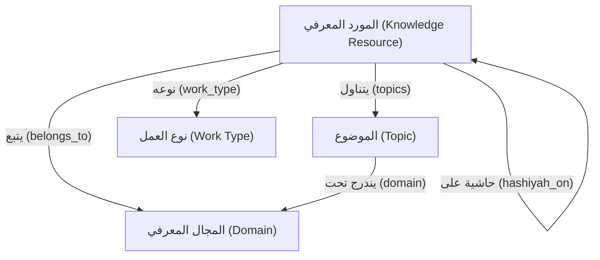

# Knowledge Taxonomy — النموذج المعرفي لتصنيف العلوم الإسلامية

> **الهدف:** بناء تقسيم هيكلي مبني على طبيعة العلم الإسلامي نفسه، وليس على طريقة أرشفة الملفات أو التحميل من الإنترنت. يضمن هذا النموذج استقرار محرك البحث والتصنيف (Athar Engine) مهما تغيرت مصادر المواد أو توسعت قاعدة البيانات.

---

## 1. المجالات المعرفية الكبرى (Knowledge Domains)
المجالات المعرفية (Domains) هي الطبقة الأولى والأهم في التصنيف. تتميز بأنها **قليلة جداً** و**شبه ثابتة لا تتغير**، وتمثل الأقسام الأمهات للعلوم الإسلامية والشعائر.

حدد المحرك **12 مجالاً معرفياً كبيراً** فقط:

1. **القرآن الكريم وعلومه:** كل ما يتعلق بالمصحف الشريف وتلاوته وتفسيره ودراساته.
2. **الحديث وعلومه:** متون السنة النبوية، شروحها، ومصطلحات روايتها وتصحيحها.
3. **العقيدة والتوحيد:** مسائل التوحيد، الإيمان، الأسماء والصفات، والردود على مقالات الطوائف.
4. **الفقه وأصوله:** الأحكام العملية التكليفية وقواعد استنباطها الفقهية والأصولية.
5. **السيرة والتاريخ:** سيرة النبي ﷺ، شمائله، وتاريخ الأمة الإسلامية العام ودولها.
6. **التراجم والطبقات:** سير حياة الرواة، والعلماء، وطبقات الحفاظ والفقهاء.
7. **اللغة العربية:** النحو والصرف، البلاغة، المعاجم وفقه اللغة، والأدب والشعر.
8. **الآداب والأخلاق:** الآداب الشرعية، الرقائق، ومسائل الزهد والتزكية القلبية.
9. **الدعوة والتزكية:** أصول الدعوة والخطابة، والأمر بالمعروف والنهي عن المنكر والتربية الشرعية.
10. **الفتاوى والبحوث:** الفتاوى المجموعة للأئمة والعلماء والرسائل العلمية المعاصرة.
11. **الأديان والفرق:** دراسة الملل والنحل، الفرق المنتسبة للإسلام، والمذاهب الفكرية المعاصرة.
12. **المكتبات وتحقيق التراث:** فهارس المخطوطات، قواعد تحقيق النصوص، وتاريخ تدوين العلوم.

---

## 2. الموضوعات الفرعية (Topics)
الموضوعات هي المستوى الثاني التفصيلي الذي يندرج تحت المجالات المعرفية الكبرى. تم تصميمها لتعكس البنية العلمية التحتية لكل علم.

### 2.1. القرآن الكريم وعلومه
* **التفسير:** شروح آيات القرآن الكريم وتفسيرها بالماثور أو الرأي.
* **علوم القرآن:** أسباب النزول، الناسخ والمنسوخ، الإعجاز، وتاريخ تدوين المصحف.
* **القراءات والتجويد:** مخارج الحروف، أحكام التجويد، والقراءات المتواترة والشاذة.
* **رسم المصحف وضبطه:** القواعد الإملائية لكتابة المصحف وعلامات الضبط.
* **أحكام القرآن:** استنباط الأحكام الفقهية من الآيات (تفسير آيات الأحكام).
* **فضائل القرآن:** الأحاديث والآثار الواردة في فضل تلاوة وحفظ سور وآيات معينة.

### 2.2. الحديث وعلومه
* **متون الحديث:** المصادر الأساسية لنصوص الأحاديث (كالصحاح والسنن والمسانيد).
* **شروح الحديث:** المؤلفات التي تشرح وتوضح معاني متون الحديث وأحكامها.
* **مصطلح الحديث:** القوانين والقواعد التي يُعرف بها أحوال السند والمتن قبولاً ورداً.
* **علل الحديث:** الأسباب الخفية الغامضة التي تقدح في صحة الحديث مع أن الظاهر السلامة منها.
* **الرجال والجرح والتعديل:** دراسة أحوال رواة الحديث من حيث القبول والرد والتوثيق والتضعيف.
* **التخريج ودراسة الأسانيد:** عزو الأحاديث إلى مصادرها الأصلية والحكم على طرقها.
* **الأجزاء الحديثية والأربعينات:** جمع الأحاديث المتعلقة بموضوع واحد أو مروية من طريق رجل واحد.
* **غريب الحديث:** تفسير الألفاظ الغامضة والبعيدة عن الفهم في نصوص السنة.

### 2.3. العقيدة والتوحيد
* **التوحيد (الربوبية والألوهية):** إفراد الله بالخلق والعبادة، وإبطال الشرك.
* **الأسماء والصفات:** إثبات ما أثبته الله لنفسه أو أثبته له رسوله من الأسماء والصفات بلا تحريف ولا تعطيل.
* **الإيمان والغيبيات:** حقيقة الإيمان وزيادته ونقصانه، ومسائل القبر والملائكة واليوم الآخر.
* **القضاء والقدر:** مراتب القدر ومسائل المشيئة والخلق وعلاقة العبد بأفعاله.
* **الإمامة والصحابة:** أحكام الخلافة، حقوق ولاة الأمر، وفضائل الصحابة والترضي عنهم.
* **الولاء والبراء:** أحكام محبة المؤمنين ونصرتهم، وبغض الكافرين ومباينتهم.
* **الفرق والردود:** مناقشة مقالات الجهمية، المعتزلة، الأشاعرة، الرافضة، والفلاسفة والرد عليها.
* **العقيدة العامة ومتون السلف:** كتب العقائد الجامعة المصنفة على طريقة أئمة الحديث المتقدمين.

### 2.4. الفقه وأصوله
* **أصول الفقه وقواعده:** أدلة الفقه الإجمالية، وطرق الاستنباط، والقواعد الفقهية الكلية.
* **العبادات:** أحكام الطهارة، الصلاة، الجنائز، الزكاة، الصيام، والحج والعمرة.
* **المعاملات والبيوع:** أحكام العقود، البيوع، الإجارة، الرهن، والشركات، والمعاملات المالية المعاصرة.
* **الأحوال الشخصية والأنكحة:** أحكام النكاح، الطلاق، النفقات، المواريث والوصايا.
* **الجنايات والحدود والقضاء:** أحكام الدماء، القصاص، الحدود الشرعية، القضاء والشهادات.
* **السياسة الشرعية:** أحكام الإمامة الكبرى، بيت المال، المعاهدات، والجهاد.
* **الفقه المقارن:** دراسة مسائل الخلاف بين المذاهب الفقهية المتعددة ومناقشة أدلتها.
* **الفقه المذهبي:** المتون والشروح المخصصة لمذهب فقهي معين (حنفي، مالكي، شافعي، حنبلي).

### 2.5. السيرة والتاريخ
* **السيرة النبوية:** أحداث حياة النبي ﷺ منذ ولادته وحتى وفاته.
* **الشمائل المحمدية:** صفات النبي ﷺ الخِلقية والخُلقية ودلائل نبوته.
* **المغازي والفتوحات:** معارك النبي ﷺ وفتوحات الخلفاء الراشدين والدول الإسلامية.
* **التاريخ الإسلامي العام:** تأريخ الحوادث والوفيات عبر السنين (كتاريخ الطبري وابن الأثير).
* **تاريخ الدول والمدن:** تاريخ مناطق معينة أو أسر حاكمة (كتاريخ بغداد وتاريخ دمشق).

### 2.6. التراجم والطبقات
* **تراجم الصحابة والتابعين:** توثيق حياة الجيل الأول والثاني وتلاميذهم.
* **تراجم العلماء والفقهاء:** سير الأئمة والفقهاء وأصحاب المذاهب.
* **طبقات الحفاظ والمحدثين:** تصنيف المحدثين حسب وفياتهم أو شيوخهم.
* **الأنساب والوفيات:** ضبط أنساب العرب والقبائل وتواريخ الوفيات.

### 2.7. اللغة العربية
* **النحو والصرف:** قواعد الإعراب وبناء الكلمة وتصريفها.
* **البلاغة والعروض:** علوم المعاني والبيان والبديع، وقواعد أوزان الشعر وبحوره.
* **فقه اللغة والمعاجم:** مفردات اللغة العربية، ترادفها، والمعاجم اللغوية الكلاسيكية.
* **الأدب والشعر العربي:** الدواوين الشعرية، المقامات، وتاريخ الأدب العربي.

### 2.8. الآداب والأخلاق
* **الرقائق والزهد:** مواعظ القلوب، الخوف والرجاء، الصبر، وأعمال القلوب.
* **الآداب الشرعية:** آداب الأكل، الشرب، النوم، اللباس، السلام، والمجالس.
* **الأخلاق والشمائل:** مكارم الأخلاق والصفات الحميدة والتحذير من مساوئ الأخلاق.

### 2.9. الدعوة والتزكية
* **الدعوة والخطابة:** مناهج الدعوة إلى الله، إعداد الخطب، وخصائص الداعية.
* **الأمر بالمعروف والنهي عن المنكر:** أحكام الحسبة، درجات الإنكار، وآداب المحتسب.
* **التربية والتزكية:** سلوك المسلم وتربية الأولاد وتصفية النفوس من الرذائل.

### 2.10. الفتاوى والرسائل
* **الفتاوى الكبرى:** مجموع الفتاوى للأئمة الكبار (مثل فتاوى ابن تيمية أو فتاوى اللجنة الدائمة).
* **الرسائل الفقهية والعقدية:** الرسائل المفردة في مسائل علمية محددة.

### 2.11. الأديان والفرق
* **الملل والنحل:** دراسة الأديان السماوية المحرفة والأديان الوضعية غير السماوية.
* **الفرق المنتسبة للإسلام:** دراسة أفكار الباطنية، الخوارج، الشيعة، الصوفية، وغيرها.
* **المذاهب الفكرية المعاصرة:** العلمانية، الليبرالية، الحداثة، العقلانية، والإلحاد المعاصر.

### 2.12. المكتبات وتحقيق التراث
* **فهارس المخطوطات والكتب:** تصنيف وتوصيف المخطوطات في دور الكتب العالمية.
* **قواعد تحقيق النصوص:** مناهج قراءة وتصحيح وإخراج المخطوطات التراثية.
* **تاريخ تدوين العلوم:** رصد كيفية نشأة العلوم الإسلامية وتطور كتابتها.

---

## 3. أنواع الأعمال (Work Types)
نوع العمل هو **محور مستقل تماماً** عن موضوع المورد المعرفي. وهو يجيب عن سؤال: "ما هي الطبيعة البنيوية والتأليفية لهذا المصنف؟"

يسمح هذا الفصل للمستخدم بالاستعلام بمرونة عالية (مثل: "أريد كل *الشروح* في *مجال العقيدة*"، أو "أريد كل *المتون* في *مجال الفقه*").

الأنواع المعتمدة في النظام:
* **مصدر أصلي:** الكتب المسندة أو المؤلفات الأولى التي تعتبر مصدراً أولياً للعلم (مثل: صحيح البخاري، سنن أبي داود، الأم للشافعي).
* **متن:** النص القصير المختصر المركز الخالي من الدليل والتعليل غالباً، والمعد للحفظ والمدارسة (مثل: متن الآجرومية، متن زاد المستقنع).
* **منظومة:** المتون العلمية المصوغة في بحر شعري لتسهيل حفظها (مثل: ألفية ابن مالك، المنظومة البيقونية).
* **شرح:** كتاب مخصص لتفكيك ألفاظ متن أو منظومة أو مصدر أصلي وتوضيح معانيه (مثل: فتح الباري، شرح العقيدة الواسطية).
* **مختصر:** اختصار لكتاب مطول بحذف الأسانيد أو الفروع المكررة مع الحفاظ على مقصده (مثل: مختصر تفسير ابن كثير).
* **حاشية / تعليق:** تعليقات وهوامش توضيحية تكتب على شرح أو كتاب آخر دون التعرض لكامل النص الأصلي بالتفصيل (مثل: حاشية ابن عابدين، حاشية الروض المربع).
* **رسالة:** كتيب أو بحث علمي مفرد في مسألة محددة صغيرة (مثل: رسالة في السجود، رسالة في التوبة).
* **مجموع / مجموع فتاوى (Collection):** تجميع لرسائل أو فتاوى أو بحوث متفرقة لمؤلف واحد في مجلد واحد أو أكثر (مثل: مجموع الفتاوى لابن تيمية، مجموع رسائل ابن رجب).
* **موسوعة:** كتاب ضخم يجمع فروع علم معين بأحجام كبيرة ومؤلفين متعددين أو لجان علمية (مثل: الموسوعة الفقهية الكويتية).
* **تحقيق / دراسة:** العمل المعاصر المبني على مقابلة نسخ المخطوط والتعليق عليه أو دراسة قضايا محددة فيه.
* **فهرس / معجم:** ترتيب هجائي أو موضوعي للألفاظ أو الكتب أو الأسماء (مثل: المعجم المفهرس لألفاظ الحديث).

> **ملاحظة حول الإصدارات (Editions):**
> لا تعتبر "الطبعة" أو "التحقيق المعين" (مثل تحقيق الأرناؤوط مقابل تحقيق التركي) كتاباً مستقلاً (Work Type)، بل هي **إصدار (Edition)** يتبع كيان الكتاب الرئيسي في شجرة البيانات. تفاصيل هذا الربط موضحة في شجرة العلاقات وتوثيق سجلات الكيانات.

---

## 4. العلاقات التحريرية المسموح بها (Editorial Relationships)
يعتمد محرك Athar Engine على بنية **الرسم البياني للمعرفة (Knowledge Graph)**. لتفادي الفوضى التصنيفية، تحكم العلاقات التحريرية (التي يقوم الإنسان بإدخالها وتدقيقها يدوياً) القواعد الآتية:

### 4.1. الكيان الشامل: المورد المعرفي (Knowledge Resource)
لم يعد الكيان الأساسي في النظام هو "الكتاب" فقط، بل تم تعميمه إلى **مورد معرفي (Knowledge Resource)** ليشمل:
* الكتب (Books)
* المنظومات (Poems)
* المقالات والبحوث (Articles)
* الأسئلة والمسائل الفقهية/العقدية (Questions)
* الفوائد العلمية المستخلصة (Benefits)
* المواد الصوتية والدروس (Audios)

### 4.2. علاقات الموارد بالمجالات والموضوعات (M-to-N)
* **المورد والمجالات:** ينتمي المورد المعرفي لمجال معرفي (Domain) رئيسي واحد على الأقل، ويسمح بتعدده في حالات المصنفات الجامعة.
* **المورد والموضوعات:** علاقة **متعدد لمتعدد (Many-to-Many)**. يمكن للمقالة أو السؤال أو الفائدة أن ترتبط بموضوع فرعي واحد أو عدة موضوعات مستقلة عبر كافة المجالات.

### 4.3. علاقات الموضوعات بالمجالات (N-to-1)
* كل **موضوع فرعي (Topic)** يجب أن يندرج تحت **مجال معرفي (Domain) رئيسي واحد فقط** كأصل رئيسي لمنع تشتت الفهارس الهرمية.

### 4.4. العلاقات البينية بين الموارد (Self-Referential)
* المورد من نوع `شرح` يجب أن يحمل حقلاً يعود للمورد الأصلي المشروح (`sharh_of: target-resource-slug`).
* المورد من نوع `حاشية` يجب أن يحمل حقلاً يعود للشرح المحشّى عليه (`hashiyah_on: commentary-resource-slug`).
* المورد من نوع `مختصر` يجب أن يحمل حقلاً يعود للأصل المختصر (`mukhtasar_of: original-resource-slug`).

---
> **تنبيه:** تم عزل علاقات الاستخراج الآلي (مثل ذكر العلماء، واقتباس الآيات، وتخريج الأحاديث) في وثيقة مستقلة تُسمى **العلاقات الدلالية (Semantic Relationships)** نظراً لطبيعتها الديناميكية المستخلصة بواسطة خوارزميات المحرك.
