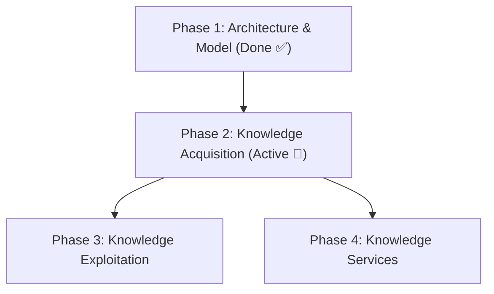

# Engineering Roadmap & Golden Corpus Specification

> **Status:** Ratified 2026-06-27 (Post-Architecture Freeze `v1.0-architecture`). This roadmap governs the engineering focus of the project, prioritizing structural data acquisition and extraction metrics over frontend feature expansion.

---

## 1. Revised Project Phases

To prevent scope creep and maintain structural discipline, the project is divided into four distinct phases. We have officially locked Phase 1 and are entering Phase 2.

### Phase 1: Architecture & Knowledge Model (Done ✅)
* **Goal:** Build the philosophical and architectural foundations of the system.
* **Outputs:** 
  * Ephemeral Semantic AST design.
  * Ingress Policy, Knowledge Taxonomy, and Canonical Tiers.
  * Separation of concerns: *Athar Engine* (compiler core) decoupled from *Ahl al-Athar* (Astro frontend).
  * Tagged: `v1.0-architecture`.

### Phase 2: Knowledge Acquisition (Active 🚀)
* **Goal:** Populate, clean, and enrich the core corpus. This is the longest and most critical phase of the engine.
* **Focus:** EPUB/DOC ingestion pipelines, regex/NER pattern extractors, Entity Registry implementation, and accuracy metrics.
* **Core Question:** "How does the engine acquire and structure correct Islamic knowledge?"

### Phase 3: Knowledge Exploitation (Future)
* **Goal:** Build features that leverage the compiled relationship graph.
* **Focus:** Interactive UI overlays (e.g., clicking an ayah to show tafsir, tapping a narrator to show biographical details), search indexing, smart navigation, and cross-referencing.

### Phase 4: Knowledge Services (Future)
* **Goal:** Expose the engine's compiled graph to external consumers.
* **Focus:** Public REST/GraphQL APIs, native Android application, translation pipelines, researcher utilities, and LLM integrations.

---

## 2. Phase 2 Milestones & Metrics

Phase 2 will be executed against measurable engineering targets:

| Milestone | Target | Description |
| :--- | :--- | :--- |
| **M-2.1: Entity Registry** | Core schema complete | Database of canonical ID records (`scholar:`, `book:`, `place:`, `sect:`) with full alias mapping. |
| **M-2.2: Golden Corpus** | Ingested & verified | Manually audited baseline dataset containing the core 6–10 texts. |
| **M-2.3: EPUB Importer v2** | Zero nesting failures | Handling complex block splits, double quote escaping, and nested footnotes. |
| **M-2.4: DOC Importer v2** | Direct-to-AST parsing | Extraction of headings and frontmatter metadata from DOC files. |
| **M-2.5: Scholar Extraction** | Recall/Precision ≥ 97% | Reliable matching of raw names to registry IDs. |
| **M-2.6: Hadith Extraction** | Extraction Accuracy ≥ 98% | Identifying is-a-hadith boundaries and text spans. |
| **M-2.7: Quran Extraction** | Extraction Accuracy ≥ 99% | Matching surah/ayah tokens and inline ayah formatting. |

---

## 3. The Golden Corpus Specification

To prevent regression when updating importers, parsers, and extractors, we establish a **Golden Corpus**. This is not a large library, but rather a small, curated set of 6–10 foundational works representing various genres and writing styles.

### 3.1. Composition of the Golden Corpus

| Domain | Book (Slug) | Type (Work Type) | Why it is included |
| :--- | :--- | :--- | :--- |
| **Hadith** | `sahih-bukhari` | مصدر أصلي | Tests complex is-a-hadith boundaries, chains of transmission, and chapter titles. |
| **Hadith** | `sahih-muslim` | مصدر أصلي | Tests consistent chains of transmission and complex chapter splits. |
| **Hadith** | `al-arbaeen-al-nawawiyyah` | متن | Tests simple, highly diacritized text structures. |
| **Creed** | `kitab-al-tawhid` | متن | Tests structured thematic items and short citation verses. |
| **Creed** | `al-aqeedah-al-wasitiyyah` | متن | Tests heavy Quranic and Hadith citation density. |
| **Tafsir** | `tafsir-al-sadi` | شرح | Tests inline Quranic citations, long paragraphs, and exegesis mapping. |

### 3.2. Governance of the Golden Corpus
1. **Manual Audit:** The Markdown outputs of these books are manually verified and locked.
2. **Regression Baseline:** Any changes to the parser, sanitizers, or extraction pipelines *must* run against the Golden Corpus first. If the output diffs from the baseline, it is flagged as a regression.
3. **No Code Churn:** The parsing schema of these books is considered stable. We do not edit them for aesthetic preferences.
