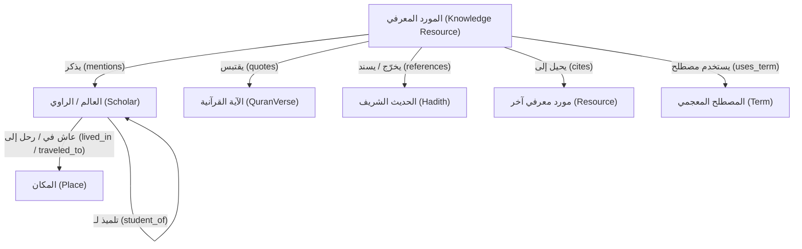

# Semantic Relationships — العلاقات الدلالية المستخلصة آلياً

> **الهدف:** توثيق وتحديد العلاقات الدلالية الديناميكية التي يستخلصها محرك Athar Engine تلقائياً من بطون النصوص أثناء مرحلة المعالجة والاستخراج (Knowledge Extraction & Enrichment). هذه العلاقات لا يكتبها الإنسان يدوياً، بل تُشتق بواسطة الخوارزميات وتُخزن في قاعدة بيانات الرسم البياني (Knowledge Graph).

---

## 1. شجرة العلاقات الدلالية
تم تقسيم العلاقات المستخلصة آلياً إلى ثلاثة محاور رئيسية:



---

## 2. تفصيل العلاقات الدلالية

### 2.1. علاقات المورد بالكيانات الخارجية (Resource to Entities)
* **المورد ← يذكر ← عالم (`Resource mentions Scholar`):**
  * *الوصف:* تحديد ذكر اسم عالم أو راوي في النص وحل الالتباس (Disambiguation) لربطه بالمعرف القانوني للعالم في سجل الكيانات (Entity Registry).
  * *أهمية:* إنشاء الفهارس الآلية لأماكن ذكر الأئمة في الكتب واستخلاص شيوخ وتلاميذ العلماء.
* **المورد ← يقتبس ← آية قرآنية (`Resource quotes QuranVerse`):**
  * *الوصف:* استخلاص النصوص المحصورة بعلامات الاقتباس القرآنية `﴿ ﴾` وتحليلها وتطابقها مع المصحف الشريف لتحديد رقم السورة والآية.
  * *أهمية:* استخلاص "التفاسير الضمنية" وعمل لوحة تحكم لكل آية تظهر أين استدل بها العلماء في كافة الموارد.
* **المورد ← يخرّج/يسند ← حديث شريف (`Resource references Hadith`):**
  * *الوصف:* التعرف على المتون الحديثية والأسانيد وربطها برقم الحديث أو المجموعات الأصلية.
  * *أهمية:* ربط كتب الشروح بمتون الأحاديث وتتبع سلاسل الرواية.
* **المورد ← يحيل إلى ← مورد آخر (`Resource cites Resource`):**
  * *الوصف:* استخلاص الإحالات الببليوغرافية للعلماء في نصوصهم (مثال: "كما ذكر البغوي في تفسيره" أو "انظر الاقتضاء للشيخ").
  * *أهمية:* قياس مدى الأثر المعرفي للكتب ومدى اعتماد المصنفين على كتب من سبوقهم.
* **المورد ← يستخدم مصطلح ← مصطلح معجمي (`Resource uses_term Term`):**
  * *الوصف:* مطابقة الكلمات المفتاحية التخصصية بمفهومها الشرعي أو اللغوي (مثل: الإيمان، القدر، الاستواء) وربطها بالتعريفات في المعجم.

### 2.2. علاقات العلماء البينية (Scholar to Scholar)
تُستخلص هذه العلاقات من كتب التراجم والوفيات، وبطون الأسانيد في كتب الحديث:
* **عالم ← يروي عن ← عالم (`Scholar narrates_from Scholar`):**
  * *الوصف:* علاقة الإسناد المباشر في سلسلة الرواية.
  * *أهمية:* بناء "شجرة الرواة" وتحديد الروايات المشتركة والمنقطعة والمرسلة.
* **عالم ← تلميذ لـ ← عالم (`Scholar student_of Scholar`):**
  * *الوصف:* علاقة التلمذة المباشرة المستمرة المذكورة في التراجم.
* **عالم ← عاصر ← عالم (`Scholar contemporary_of Scholar`):**
  * *الوصف:* علاقة المعاصرة الزمنية بناءً على تاريخ الوفاة والميلاد والطبقة العلمية.

### 2.3. علاقات الكيانات الجغرافية والمذاهب
* **عالم ← عاش في / ولد في ← مكان (`Scholar lived_in / born_in Place`):**
  * *الوصف:* ربط العلماء بمواطنهم الأصلية أو رحلاتهم لطلب العلم (Sham, Iraq, Hijaz).
  * *أهمية:* إنشاء خرائط جغرافية تفاعلية لمدارس العلم الإسلامي.
* **عالم ← ينتسب لـ ← مذهب / فرقة (`Scholar adheres_to Sect`):**
  * *الوصف:* نسبة العالم العقدية أو الفقهية (حنبلي، أشعري، معتزلي، إلخ).

---

## 3. آلية الاستخلاص والتحقق (Pipeline Steps)
يمر النص بالخطوات الآتية لبناء هذه العلاقات ديناميكياً:

```
[نص خام من مورد معرفي] 
      ↓ (مرحلة التجزئة والتعرف التلقائي بـ Regex/NER)
[تحديد الكلمات المشتبهة كأنها كيانات: أسماء، آيات، أحاديث، مصنفات]
      ↓ (مرحلة مطابقة الأسماء وحل الالتباس Disambiguation ضد الكيانات القياسية)
[الربط بالمعرف الفريد canonical-id للكيان]
      ↓ (مرحلة الإنشاء الفعلي للرابط الدلالي في محرك Athar)
[تسجيل الرابط دلالياً كحقل علاقة: mentions, quotes, cites...]
```

تتميز هذه العلاقات بأنها **احتمالية (Probabilistic)** في البداية، وتتدرج بثقة (Confidence Score) من `0.0` إلى `1.0`. لا يسجل المحرك علاقة إلا إذا تخطت حد الثقة المحدد في إعدادات المحرك.
